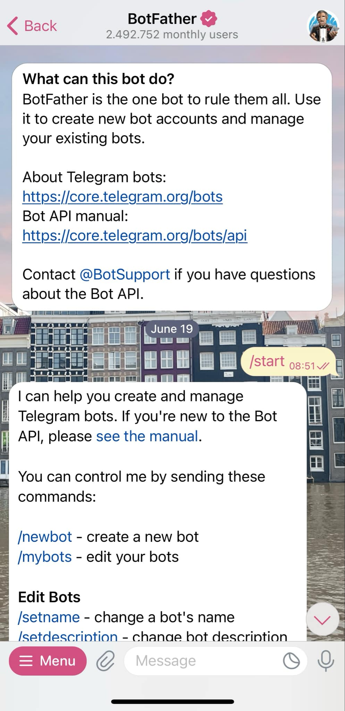

# Create your own Telegram chatbot

In fast-paced tech businesses, decisions need to be made in real-time to seize opportunities and overcome challenges. What if your manager could get updates on critical business metrics instantly, right from a Telegram chatbot? Every key metrics can be delivered in a chat message, making it easier than ever to make informed, data-driven decisions on time!

This guide will help you build a Telegram chatbot that can communicate with your manager and provide vital business metrics whenever they need them. No more waiting for weekly or monthly reports – it's all about instant updates that help the business grow.

---
# Step-by-Step Guide to Building Your Telegram Bot

## Step 1: Create Your Telegram ChatBot

- Open Telegram and search for "BotFather".
- Type /start to start interacting with BotFather.

- Use the command /newbot to create a new bot.
- Give your bot a unique name. Once done, you'll receive a Bot Token. Save this token, as you'll use it to interact with the Telegram Bot API.

## Step 2: Sync your ChatBot to a Google Sheets link using Google Apps Script

1. **Access Google Apps Script**:
   - Open your Google Sheets file.
   - Click on `Extensions` > `Apps Script` to open the Google Apps Script editor.

2. **Write the Script**:
   Here, we will write a script that fetches data from your Google Sheet and sends it as a message to your Telegram bot. You can take a look at the code example I provided in the file `code.js`.

**Understand the Script:**

- The BOT_TOKEN and CHAT_ID are placeholders.
- Replace YOUR_TELEGRAM_BOT_TOKEN with your actual Telegram bot token from BotFather.
- Replace YOUR_CHAT_ID with your Telegram chat ID where you want to receive the notifications. You can use the bot to find your chat ID or the group's ID.
- The script pulls data from the Google Sheet, formats it as a message, and sends it to your Telegram bot using Telegram’s sendMessage API.

## Step 3: Test the Script

1. **Send a Test Notification:**

- Save the script by clicking the disk icon in the Apps Script editor.
- Click the clock icon (Triggers) on the left sidebar to create a new trigger.
- Set it up to run the `sendTelegramNotification` function, either manually or at scheduled intervals (e.g., every hour).

**_Example trigger settings:_**
- Choose which function to run: `sendTelegramNotification`
- Choose which deployment should run: `Head`
- Select event source: `Time-driven`
- Select type of time-based trigger: `Minutes timer` (you can choose the frequency)

2. **Run the Script Manually:** You can manually trigger the function by clicking the play button in the Apps Script editor. This should send a test notification with data from your Google Sheets.

